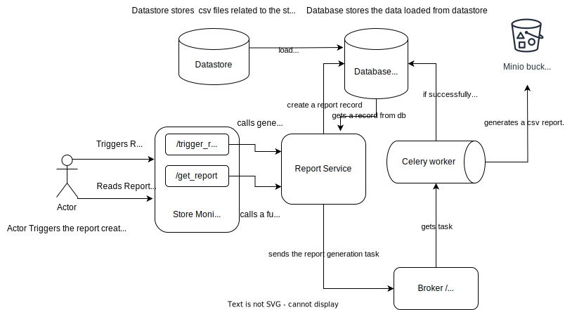

# Store Monitor API

The Store Monitor API is a FastAPI-based API that generates reports on store uptime and downtime. It calculates uptime and downtime for the last 1 hour, last 1 day, and last 1 week.


## Architecture Diagram


## Table of Contents

- [Overview](#overview)
- [Features](#features)
- [Directory Structure](#directory-structure)
- [Prerequisites](#prerequisites)
- [Installation](#installation)
- [Usage](#usage)
- [Endpoints](#endpoints)

## Overview

The Store Monitor API provides a way to calculate and generate reports for store uptime and downtime.

## Features

- Calculates store uptime and downtime.
- Generates reports for the last 1 hour, last 1 day, and last 1 week

## Directory Structure

The project directory is structured as follows:

app/                # Main application code
│
├── db/              # Database-related code and configuration
│
├── models/          # Data models and database schema definitions
│
├── routes/          # API route definitions
│
├── schema/          # Pydantic schema definitions for request and response validation
│
├── service/         # Business logic and service layer
│
├── utils/           # Utility modules and helper functions
│
├── main.py           # Main FastAPI application instance
│
├── worker.py         # Celery task script for background processing
│
images/             # System architecture diagrams and images
│
migrations/         # Initial SQL files for setting up initial database tables
│
.env.example         # Example environment variables file
│
docker-compose.yml  # Docker Compose configuration for setting up services
│
Dockerfile.dev      # Dockerfile for development environment
│
MakeFile            # Makefile with useful commands for development
│
pipeline.py         # Script to load data from CSV to DataFrame


## Steps to run the project

1. Clone this repository to your local machine.
2. Create a `.env` file based on `.env.example` and fill in the required configuration.
3. Build and run the Docker container using `docker-compose`:

```bash
docker-compose up --build
```

## Steps to ingest data

1. Create a `datastore` folder in the root directory of the project.
2. Inside that create
   - store_business_hours.csv
   - store_status.csv
   - store_timezone.csv
3. Once the container is running, run the following command to ingest data into the database

```bash
docker exec -it store-monitor-api python pipeline.py
```

## Usage

1. Once the container is running, you can access the API documentation at `http://localhost:8000/api/docs`.
2. Use the provided endpoints to calculate and retrieve store uptime and downtime reports.

## Endpoints

- `GET /trigger_report`: Trigger a report generation task
- `POST /get_report`: Get a report for the last 1 hour, last 1 day, or last 1 week for all stores

Refer to the API documentation for detailed information about request and response structures.
